# FINAL PROJECT REPORT

## 1. Identitas

**Nama:** Nandika Rizki Prapanca

**NIM:** A11.2023.15179

**Kelas:** A11.4602

**Repository:**
https://github.com/NandikaPrapanca/tugas2-simple-lms-django-docker

---

# 2. Deskripsi Project

Project ini merupakan backend **Learning Management System (LMS)** yang dibangun menggunakan **Django**, **Django Ninja**, dan **Docker**. Sistem menyediakan REST API untuk mengelola course, autentikasi pengguna, enrollment, progress pembelajaran, dashboard, announcement, serta berbagai optimasi backend seperti Redis Cache, MongoDB Logging, RabbitMQ, Celery, dan Flower Monitoring.

---

# 3. Fitur Dasar yang Sudah Berjalan

Fitur utama yang telah berhasil diimplementasikan meliputi:

* JWT Authentication
* User Registration
* CRUD Course
* Upload Course Image
* Course Filtering
* Searching
* Ordering
* Pagination
* Enrollment
* Learning Progress
* Redis Cache
* Redis Session Storage
* MongoDB Activity Logging
* RabbitMQ Message Broker
* Celery Async Task
* Flower Monitoring
* Async Report Generation

---

# 4. Fitur Tambahan yang Dipilih

| No | Fitur                                    | Kategori          | Poin | Status    |
| -- | ---------------------------------------- | ----------------- | ---- | --------- |
| 1  | Course Announcement System               | Learning Features | 10   | ✅ Selesai |
| 2  | Student Dashboard                        | Dashboard         | 12   | ✅ Selesai |
| 3  | Instructor Dashboard                     | Dashboard         | 12   | ✅ Selesai |
| 4  | Response dan Error Format Konsisten      | API Improvement   | 10   | ✅ Selesai |

**Total Poin Tambahan:** **44 Poin**

---

# 5. Penjelasan Implementasi

## Course Announcement System

Teacher dapat membuat announcement pada course yang dimilikinya. Student dapat melihat announcement dari course tersebut. Sistem menerapkan ownership validation sehingga teacher hanya dapat membuat announcement pada course miliknya.

Endpoint:

* POST /courses/{course_id}/announcements/
* GET /courses/{course_id}/announcements/

---

## Student Dashboard

Dashboard student menampilkan ringkasan aktivitas belajar berupa:

* Total Course
* Enrolled Course
* Completed Course
* Ongoing Course

Endpoint:

GET /student/dashboard/

---

## Instructor Dashboard

Dashboard teacher menampilkan statistik course yang dimiliki.

Informasi yang ditampilkan:

* Total Course
* Total Student
* Total Announcement

Endpoint:

GET /teacher/dashboard/

---

## Response dan Error Format Konsisten

Seluruh endpoint baru menggunakan format response yang konsisten sehingga lebih mudah digunakan oleh frontend.

Contoh Success Response

```json
{
    "success": true,
    "message": "Request berhasil",
    "data": {}
}
```

Contoh Error Response

```json
{
    "success": false,
    "message": "Resource tidak ditemukan",
    "errors": {}
}
```

---

# 6. Cara Menjalankan Project

Clone repository

```bash
git clone https://github.com/NandikaPrapanca/tugas2-simple-lms-django-docker.git
```

Masuk ke project

```bash
cd tugas2-simple-lms-django-docker
```

Build Docker

```bash
docker compose build
```

Menjalankan container

```bash
docker compose up -d
```

Migration

```bash
docker compose exec web python manage.py migrate
```

Create Superuser

```bash
docker compose exec web python manage.py createsuperuser
```

Swagger

```
http://localhost:8000/api/v1/docs
```

Admin

```
http://localhost:8000/admin/
```

Flower

```
http://localhost:5555
```

---

# 7. Akun Demo

| Role    | Username | Password               |
| ------- | -------- | ---------------------- |
| Admin   | admin    | admin123               |
| Teacher | teacher  | teacher123             |
| Teacher | teacher2 | teacher123             |
| Student | student  | student123             |

---

# 8. Endpoint Penting

## Authentication

* POST /api/v1/auth/pair
* POST /api/v1/register

## Course

* GET /api/v1/courses
* POST /api/v1/courses
* PUT /api/v1/courses/{id}
* PATCH /api/v1/courses/{id}
* DELETE /api/v1/courses/{id}

## Upload Image

* POST /api/v1/courses/{id}/upload-image

## Announcement

* POST /api/v1/courses/{course_id}/announcements
* GET /api/v1/courses/{course_id}/announcements

## Dashboard

* GET /api/v1/student/dashboard
* GET /api/v1/teacher/dashboard

## Report

* POST /api/v1/reports/generate/{course_id}
* GET /api/v1/reports/status/{task_id}

---

# 9. Screenshot / Bukti Pengujian

Lampirkan screenshot berikut:

* Swagger Documentation
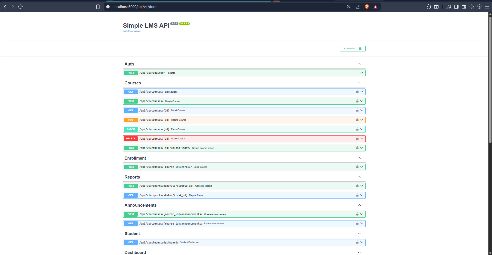

* JWT Authentication
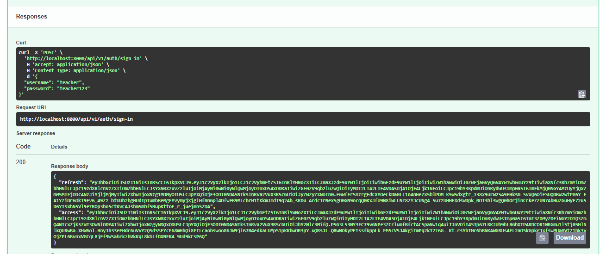

* CRUD Course
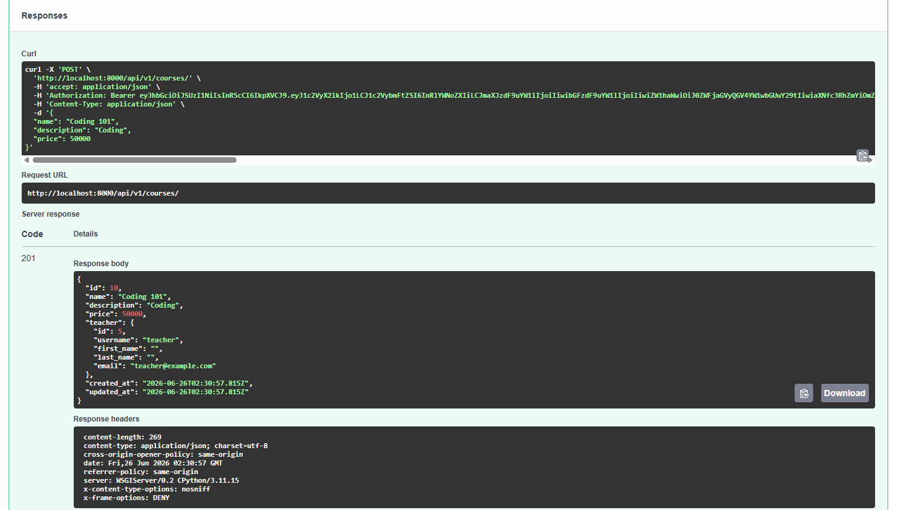
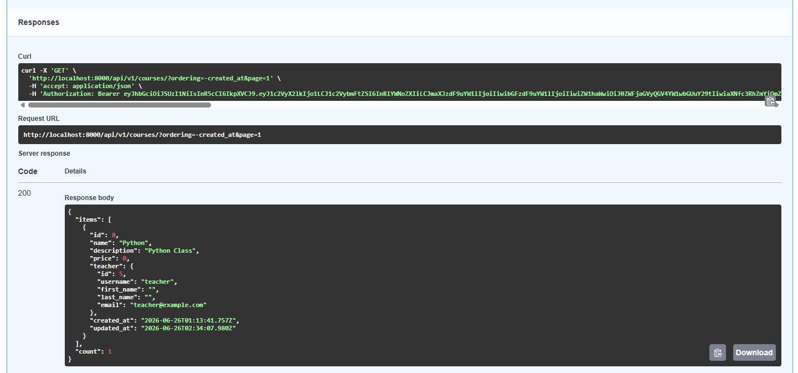
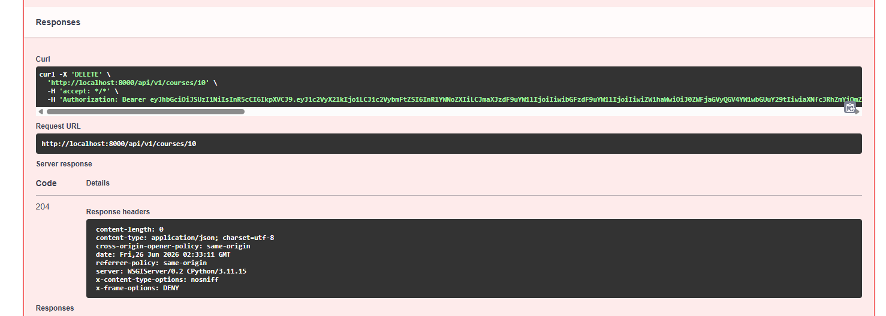
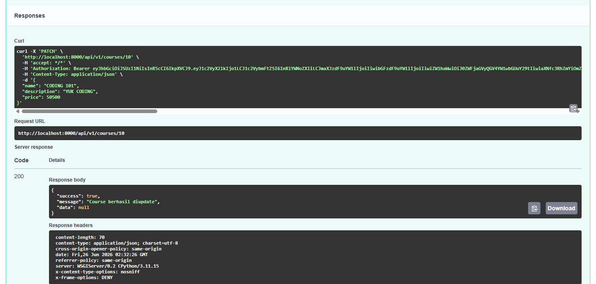

* Upload Image
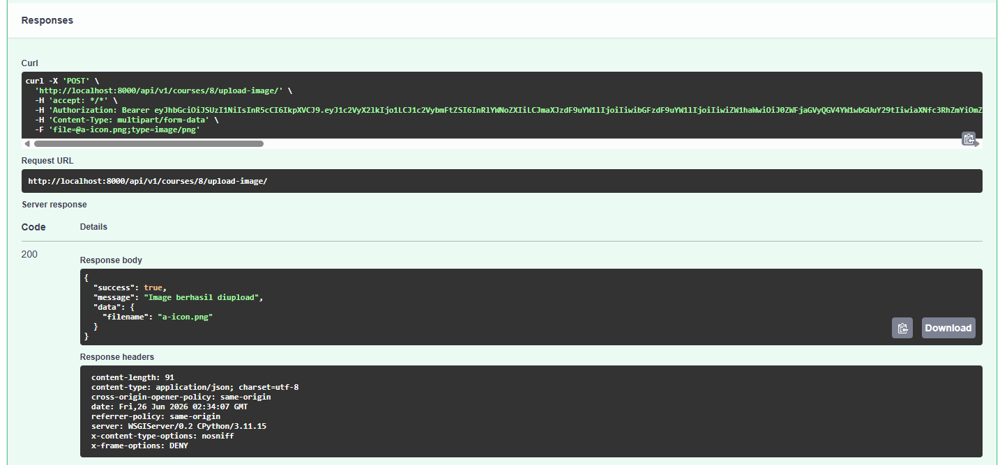

* Redis Cache
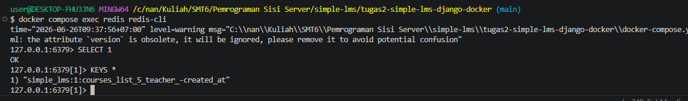

* MongoDB Activity Log
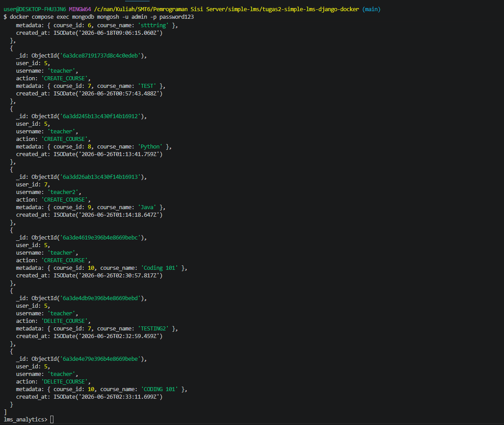

* Flower Dashboard
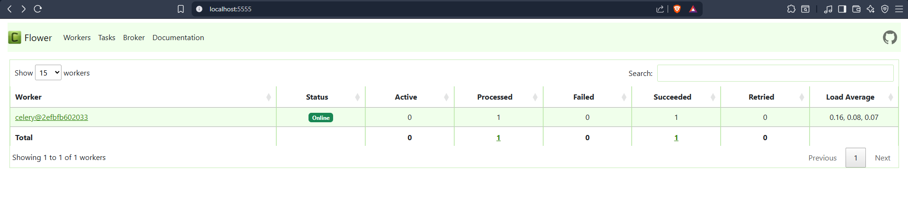

* Course Announcement
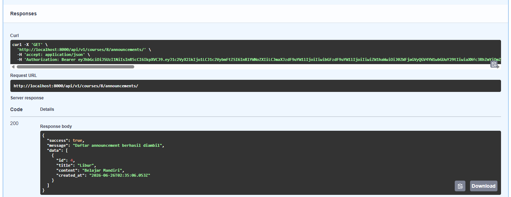

* Student Dashboard
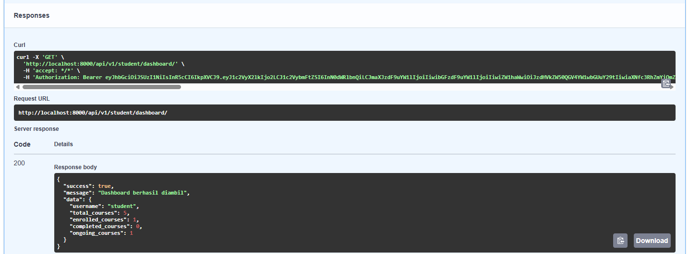

* Instructor Dashboard
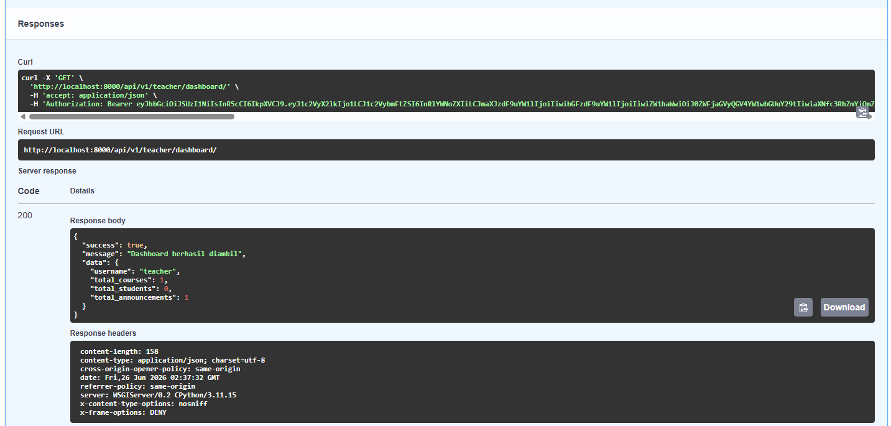

* Consistent API Response

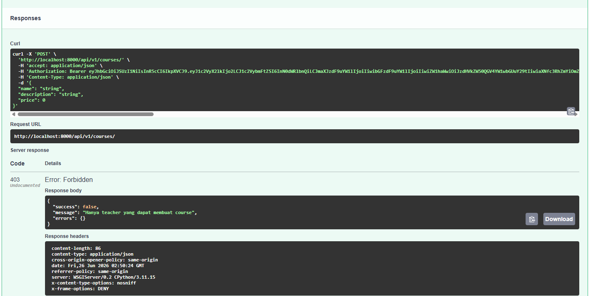

* Docker Containers Running
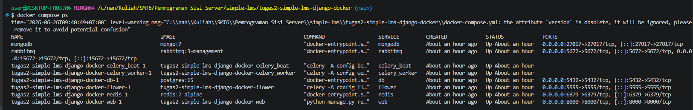

---

# 10. Kendala dan Solusi

| Kendala                                                                  | Solusi                                                                                                         |
| ------------------------------------------------------------------------ | -------------------------------------------------------------------------------------------------------------- |
| Ownership course belum berjalan karena Redis cache menyimpan data global | Menggunakan cache key yang berbeda berdasarkan role dan user sehingga data teacher tidak tercampur             |
| Invalid JWT menghasilkan Internal Server Error                           | Memperbaiki proses authentication dan penanganan exception JWT                                                 |
| Response API tidak konsisten                                             | Membuat helper `success_response()` dan `error_response()` sehingga seluruh endpoint memiliki format yang sama |
| Teacher dapat mengakses course teacher lain                              | Menambahkan ownership validation pada endpoint course dan announcement                                         |

---

# 11. Kesimpulan

Melalui final project ini saya mempelajari pengembangan backend modern menggunakan Django dan Django Ninja, mulai dari perancangan REST API, autentikasi JWT, optimasi query database, Redis Cache, MongoDB Logging, RabbitMQ, Celery, Docker, hingga penerapan authorization dan response API yang konsisten. Project ini memberikan pengalaman dalam membangun backend LMS yang lebih terstruktur, aman, dan siap diintegrasikan dengan aplikasi frontend.
