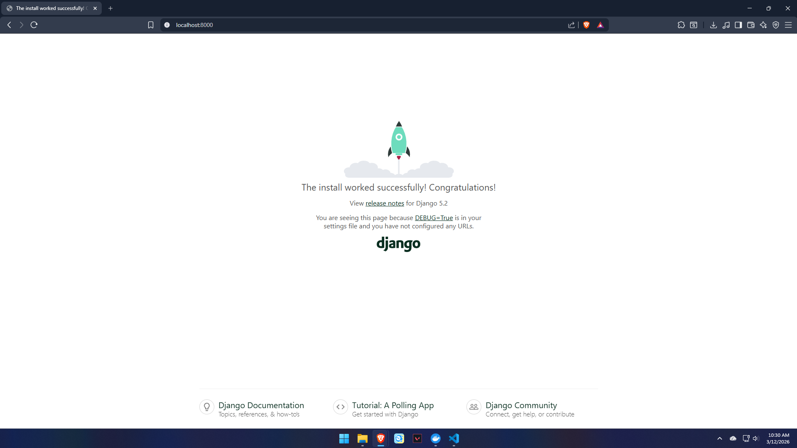

# Simple LMS - Django Docker Setup

Project ini merupakan setup environment development untuk aplikasi **Django Simple LMS** menggunakan **Docker** dan **PostgreSQL** sebagai database.

## Cara Menjalankan Project

1. Build docker image

```bash
docker compose build
```

2. Jalankan container

```bash
docker compose up
```

3. Jalankan migration database

Buka terminal baru lalu jalankan:

```bash
docker compose exec web python manage.py migrate
```

4. Akses aplikasi

Buka browser dan masuk ke:

```
http://localhost:8000
```

Jika berhasil maka halaman Django akan tampil.

---

## Environment Variables Explanation

Project ini menggunakan environment variables untuk konfigurasi database PostgreSQL.

Contoh isi file `.env.example`:

```
POSTGRES_DB=lmsdb
POSTGRES_USER=lmsuser
POSTGRES_PASSWORD=lmspassword
POSTGRES_HOST=db
POSTGRES_PORT=5432
```

Penjelasan:

| Variable | Fungsi |
|--------|--------|
| POSTGRES_DB | Nama database PostgreSQL |
| POSTGRES_USER | Username database |
| POSTGRES_PASSWORD | Password database |
| POSTGRES_HOST | Host database (container db) |
| POSTGRES_PORT | Port PostgreSQL |

Environment variables ini digunakan oleh Django untuk melakukan koneksi ke database PostgreSQL yang berjalan di dalam container Docker.

---

## Screenshot Django Welcome Page

Berikut adalah tampilan halaman awal Django setelah container berhasil dijalankan.



Halaman ini dapat diakses melalui:
http://localhost:8000

Jika halaman ini muncul, berarti:

- Docker container berjalan dengan baik
- Django berhasil dijalankan
- Koneksi ke PostgreSQL berhasil